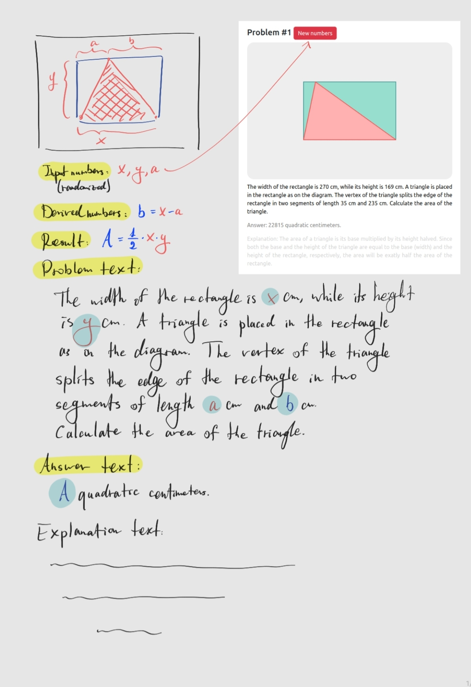
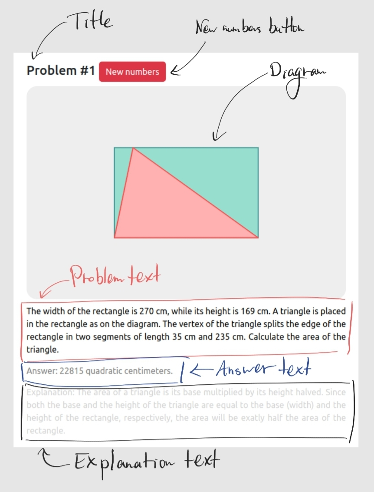

# Milkyway-Generator

## Work strategy

The work is divided in two conceptual parts: that of the `problem designer` and `programmer`.

The `problem designer`:
- chooses a problem in accordance with the course syllabus;
- draws visualization of the problem (`DIAGRAM`);
- defines and explains any needs for interactive behaviour on the `DIAGRAM`;
- lists all the variables that need to be randomly generated (`INPUT-NUMBERS`);
- lists all the variables that are derived from the input numbers and states their dependence (`DERIVED-NUMBERS`);
- gives the equation for the solution of the problem (`RESULT`);
- composes the text of the problem (`PROBLEM-TEXT`);
- composes the text of the answer (`ANSWER-TEXT`);
- (optionally) composes the explanation (`EXPLANATION-TEXT`).



Accordingly the `programmer`:
- initializes the `INPUT-NUMBERS` randomly;
- defines a function to calculate `DERIVED-NUMBERS` and the `RESULTS`;
- draws the `DIAGRAM` using the above generated values;
- adds interactive behaviour to the `DIAGRAM` (events and listeners);
- generates strings for `PROBLEM-TEXT`, `ANSWER-TEXT`(, `EXPLANATION-TEXT`);
- defines a function to update the `DIAGRAM` and all the `TEXTS` when the numbers are updated (either when the user requests new numbers using the button or when an event is fired on the `DIAGRAM`).



`Problem` is the base class for every specific problem. By default, it has:
- `Problem.parent_selector` -- a CSS selector for the parent object (e.g. `"#container"`);
- `Problem.problem_number` -- this defines enumeration if the problem is used in a quiz;
- `Problem.problem_div` -- container of the problem (`<div>`);
- `Problem.title` -- title object for the problem (`<h4>`);
- `Problem.new_numbers_button` -- button for the user to generate new numbers (`<button>`);
- `Problem.new_numbers()` -- function to be fired when the new numbers button is pressed (`void`);
- `Problem.diagram` -- the diagram of the problem (an instance of the `Diagram` class);
- `Problem.text` -- problem text object (`<p>`);
- `Problem.answer` -- answer text object (`<p>`);
- `Problem.explanation` -- explanation text object (`<p>`);

Any specific problem extends the `Problem` class as follows:

```javascript
class MyAwesomeProblem extends Problem {
	constructor(...) {
		super(...);
	}

    randomize_and_calculate() {
        // This function should randomize the input
        // and calculate the answer using new numbers.
    }

    draw_diagram() {
        // This function should draw the diagram.
    }

    update_diagram() {
        // This function should update the diagram
        // when the variables change.
    }

    update_text() {
        // This function should update the texts:
        // problem-text, answer-text(, explanation-text).
    }

    new_numbers() {
        // This function should reset the numbers and
        // everything on the screen... Typically, it looks
        // like this as defined in the base class:
        this.randomize_and_calculate();
        this.update_diagram();
        this.update_text();
        // Mostly, there is no need to redefine this.
    }
}
```

The problem then appears in the `HTML` simply by adding

```javascript
p1 = new MyAwesomeProblem("#container");
```

to the script.


<hr>

## Technical details

### Server execution

The generation is happening 100% on the client side. Consequently, there are no strict requirements from the server. To run a simple `http` server locally, one can use `python` as

```powershell
python -m http.server 8000
```

(alternatively, you can use your favourite server software).